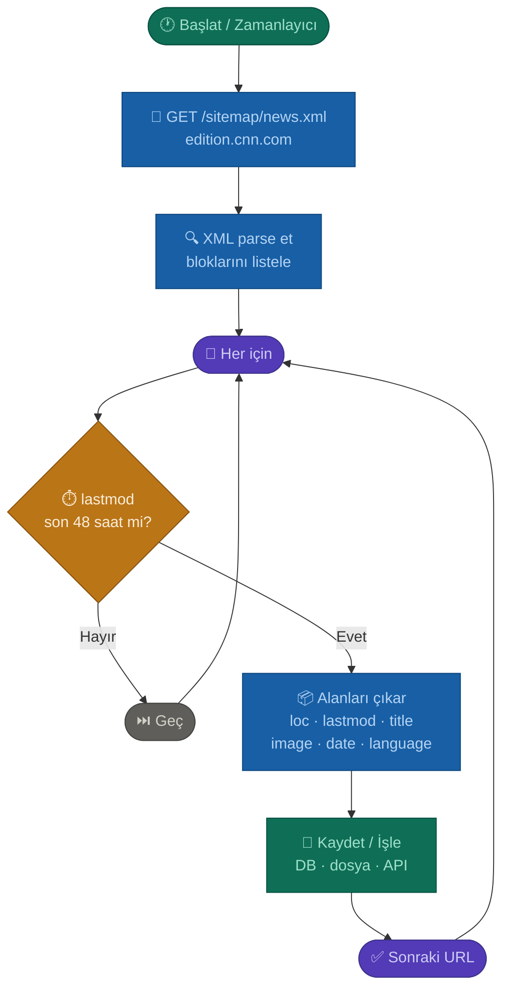

```mermaid
flowchart TD
    A([🕐 Başlat / Zamanlayıcı]) --> B

    B["📡 GET /sitemap/news.xml\nedition.cnn.com"] --> C

    C["🔍 XML parse et\n<url> bloklarını listele"] --> D

    D(["🔁 Her <url> için"]) --> E

    E{"⏱️ lastmod\nson 48 saat mi?"}

    E -- Hayır --> F([⏭️ Geç])
    F --> D

    E -- Evet --> G

    G["📦 Alanları çıkar\nloc · lastmod · title\nimage · date · language"] --> H

    H["💾 Kaydet / İşle\nDB · dosya · API"] --> I

    I([✅ Sonraki URL]) --> D

    style A fill:#0f6e56,color:#9fe1cb,stroke:#085041
    style D fill:#533ab7,color:#ceceF6,stroke:#3c3489
    style I fill:#533ab7,color:#ceceF6,stroke:#3c3489
    style F fill:#5f5e5a,color:#d3d1c7,stroke:#444441
    style E fill:#ba7517,color:#faeeda,stroke:#854f0b
    style B fill:#185fa5,color:#b5d4f4,stroke:#0c447c
    style C fill:#185fa5,color:#b5d4f4,stroke:#0c447c
    style G fill:#185fa5,color:#b5d4f4,stroke:#0c447c
    style H fill:#0f6e56,color:#9fe1cb,stroke:#085041
```